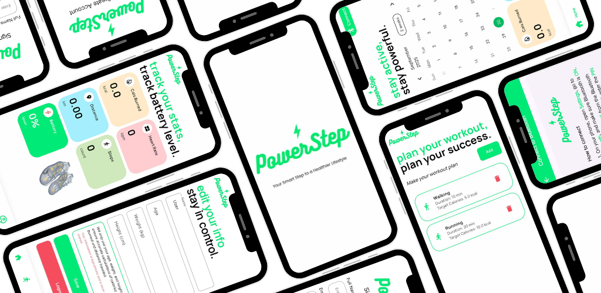
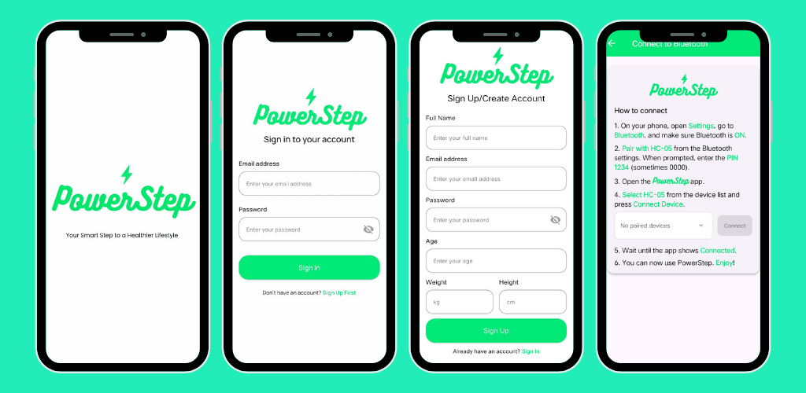

# 🚀 PowerStep

PowerStep is an IoT-based fitness tracking app built with Flutter. It connects to a **smart, energy-converting insole** via Bluetooth — allowing users to monitor their steps, heart rate, and calories burned, while also tracking the energy generated from walking. The goal is to demonstrate sustainable energy harvesting through wearable technology.

---

## ✨ Features
- 👤 User sign in and sign up 
- 🔗 Bluetooth connectivity to pair with the PowerStep energy-converting insole  
- ⚡ Real-time tracking of harvested energy output  
- 🦶 Step counter and distance tracker  
- ❤️ Heart rate and calorie burn monitoring  
- 🌙 Minimal, responsive UI design with a focus on clarity and usability  

---

## 📸 Screenshots





---

## 🛠️ Built With
- [Flutter](https://flutter.dev)
- [sqflite](https://pub.dev/packages/sqflite) for local data storage
- [Provider](https://pub.dev/packages/provider) for state management
- [Dio](https://pub.dev/packages/dio) for HTTP requests
- [Bluetooth Low Energy (BLE)](https://pub.dev/packages/flutter_blue_plus) for IoT device communication

---

## 🚀 Getting Started

👉 [Download APK](https://github.com/Yujin2722/PowerStep/releases)  
(or install manually following the steps below)

```bash
git clone https://github.com/Yujin2722/PowerStep.git
cd PowerStep
flutter pub get
flutter run
